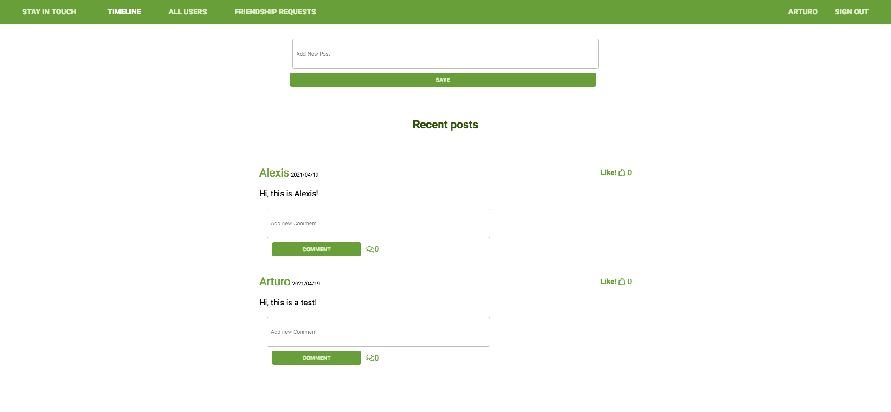

# Scaffold for social media app with Ruby on Rails

> This is a basic Social Media App (think Facebook) where users can befriend other users where the main objective was to build advanced model associations.

# About

> This is a social media app where you can create posts, add other users as friends, and make comments or like another post. The main purpose of this project was to build advanced associations, scopes for faster queries, and model methods.

What you can do on the app:
- Sign up and Log in
- Add other users as friends
- Accept or rejects friend requests
- See the status of your relationship with other users
- Create posts and see posts from your friends
- Users can comment and like on their friends' posts

In this project we:
- Used PostgreSQL as the database
- Created advanced associations between users
- Used scopes to make more efficient database queries
- Created models, views, and controllers for users
- Used devise gem for user authentication and authorization
- We implemented integration tests with Capybara
- Used Rspec to test model validations and associations

# Application Screenshot



## Built With

- Ruby v2.7.2
- Ruby on Rails v6.0.3.6
- Heroku
- PostgreSQL

## Live Demo

You can visit [here](https://fast-wildwood-38105.herokuapp.com) our app.

## Getting Started

To get a local copy up and running follow these simple example steps:

- Clone this repository.
- Open the project folder where the repository was downloaded.
- In your terminal, run the command `bundle install`. This will install all the required dependencies.
- Thereafter, run the migrations. To do this, while in the project root folder, run the command: `rails db:migrate`.
- Run the command `yarn install --check-files` to install all the yarn dependencies of the project.

## Prerequisites

- Ruby v2.7.2
- Ruby on Rails v6.0.3.6
- Postgres: >=9.5

## Usage
### Heroku

- Open this [link](https://fast-wildwood-38105.herokuapp.com) in your browser

### Local

- Start the server with:

```
    rails server
```
- Open `http://localhost:3000/` in your browser

### Instructions

1. Create a user in 'Sign Up'
2. Post something
3. Add a friend in 'All Users'
4. Wait for a response
5. If your friend request is accepted, now you can see each other's posts

### Run tests

```
    rpsec --format documentation
```

In this project there are two different types of tests:

- Integration Tests made with Capybara (You will need a Chrome browser for these tests to work.)
- Unit Tests made with Rspec

## Authors

👤 **Alexisbec**
- Github: [@alexisbec](https://github.com/alexisbec)
- Linkedin: [Alexis Varela](www.linkedin.com/in/alexbec)
- Twitter : [@AlexisV31667779](https://twitter.com/AlexisV31667779)

👤 **Arturo Alvarez**
- Github: [@StarSheriff2](https://github.com/StarSheriff2)
- Twitter: [@ArturoAlvarezV](https://twitter.com/ArturoAlvarezV)
- Linkedin: [Arturo Alvarez](https://www.linkedin.com/in/arturoalvarezv/)

## 🤝 Contributing

Contributions, issues, and feature requests are welcome!

## Show your support

Give a ⭐️ if you like this project!

## 📝 License

This project is [MIT](https://github.com/alexisbec/ror-social-scaffold/blob/master/LICENSE) licensed.
