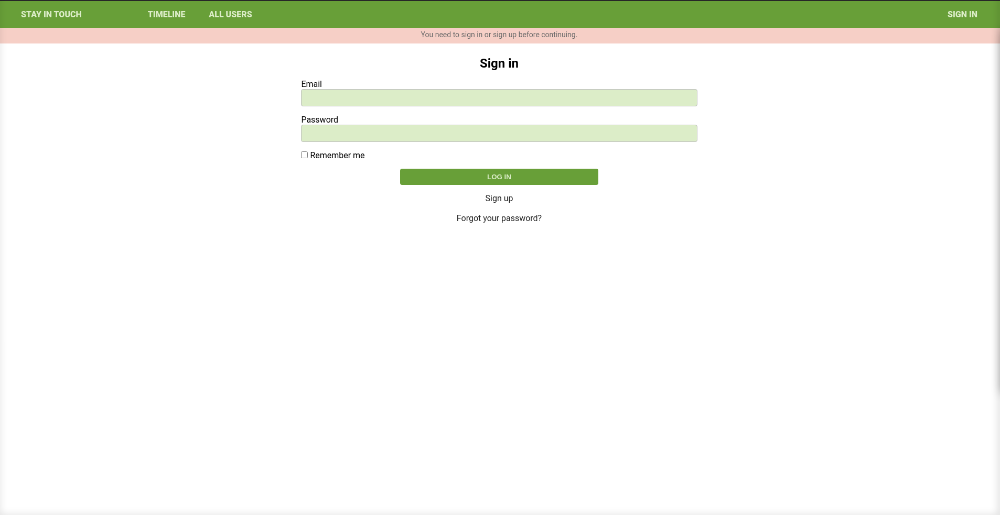
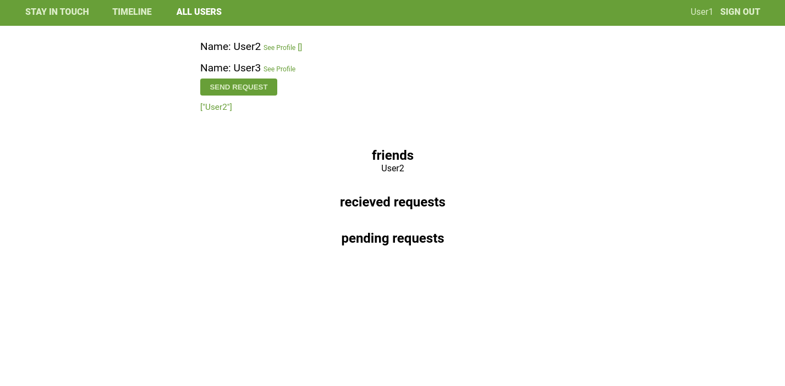

# Scaffold for social media app with Ruby on Rails

## Project Specification

Build a social media app called “Stay in touch”.

### As a guest user:

I want to be able to create account/log in.

I can see only “Sign in” and “Sign out” page.

### As a logged-in user:

I want to be able to see all users list.

I want to be able to see selected user page with their user name and all posts written by them (the most recent posts on the top).

I want to be able to send a friendship invitation.

I want to see a button “Invite to friendship” next to the name of user who is not my friend yet - on both users’ list and single user page.

I want to be able to see pending friendship invitations sent to me from other users.

I want to be able to accept or reject friendships invitation.

I want to be able to create new posts (text only).

I want to be able to like/dislike posts (but I can like single post only once).

I want to be able to add comments to posts.

I want to be able to see “Timeline” page with posts (with number of likes and comments) written by me and all my friends (the most recent posts on the top).

Timeline page should be the root page of the app.

#### Without logging in

> 

#### Logged in all users page

> 

## Built With

- Ruby v3.0.0
- Ruby on Rails v6.1

## Live Demo
 https://warm-sands-12158.herokuapp.com/

## Getting Started

To get a local copy up and running follow these simple example steps.

### Prerequisites

Ruby: 3.0.0
Rails: 6.1.3
Postgres: >=9.5

### Setup

Install gems with:

```
bundle install
```

Setup database with:

```
   rails db:create
   rails db:migrate
```

### Github Actions

To make sure the linters' checks using Github Actions work properly, you should follow the next steps:

1. On your recently forked repo, enable the GitHub Actions in the Actions tab.
2. Create the `feature/branch` and push.
3. Start working on your milestone as usual.
4. Open a PR from the `feature/branch` when your work is done.

### Usage

Start server with:

```
    rails server
```

Open `http://localhost:3000/` in your browser.

### Run tests

```
    rpsec --format documentation
```

> Tests will be added by Microverse students. There are no tests for initial features in order to make sure that students write all tests from scratch.

### Deployment

From console run the following commands after cloning

```
   heroku login (login to heroku)
   heroku create stayintouch (or any app name you like)
   git push heroku main (pushing from the main branch)

```

## Authors

👤 **Author1**

- GitHub: [@apricot12](https://github.com/apricot12)
- Twitter: [@apricotfoxtrot](https://www.twitter.com/apricotfoxtrot)

👤 **Author2**

- Github: [@arikarim](https://github.com/arikarim)
- Twitter: [Ari Karim](https://twitter.com/AriKari86036498)

## 🤝 Contributing

Contributions, issues and feature requests are welcome! Start by:

- Forking the project
- Cloning the project to your local machine
- `cd` into the project directory
- Run `git checkout -b your-branch-name`
- Make your contributions
- Push your branch up to your forked repository
- Open a Pull Request with a detailed description to the development branch of the original project for a review

## Show your support

Give a ⭐️ if you like this project!

## Acknowledgments

- Thanks to Odin project for the tutorials.

## 📝 License

This project is [MIT](LICENSE) licensed.