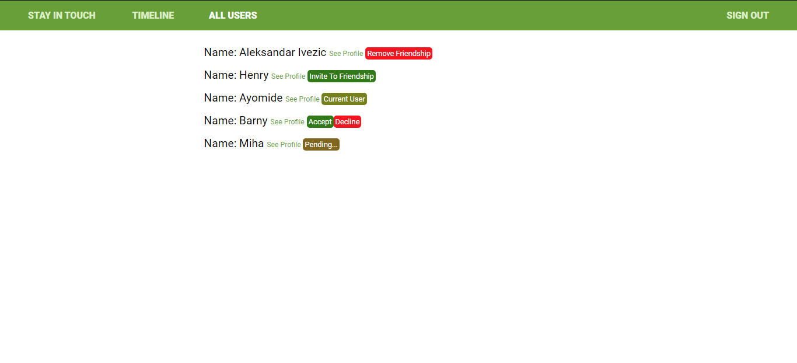

# Scaffold for social media app with Ruby on Rails



> This repo includes intial code for social media app with basic styling. Its purpose is to be a starting point for Microverse students.

## Built With

- Ruby v2.7.0
- Ruby on Rails v5.2.4

## Live Demo
[Live Demo Link](https://fast-eyrie-06446.herokuapp.com)


## Getting Started

To get a local copy up and running follow these simple example steps.

### Prerequisites

Ruby: 2.6.3
Rails: 5.2.3
Postgres: >=9.5

### Setup

Instal gems with:

```
bundle install
```

Setup database with:

```
   rails db:create
   rails db:migrate
```

### Github Actions

To make sure the linters' checks using Github Actions work properly, you should follow the next steps:

1. On your recently forked repo, enable the GitHub Actions in the Actions tab.
2. Create the `feature/branch` and push.
3. Start working on your milestone as usual.
4. Open a PR from the `feature/branch` when your work is done.


### Usage

Start server with:

```
    rails server
```

Open `http://localhost:3000/` in your browser.

### Run tests

```
    rspec --format documentation
```

> Tests will be added by Microverse students. There are no tests for initial features in order to make sure that students write all tests from scratch.


## Authors

👤 **HENRY ONU**

- GitHub: [@githubhandle](https://github.com/Henryhaulka)
- Twitter: [@twitterhandle](https://twitter.com/ONUHENRY12)
- LinkedIn: [LinkedIn](https://www.linkedin.com/in/henry-onu)


👤 **Aleksandar Ivezic**

- GitHub: [Aleksandar Ivezic](https://github.com/ShinobiWarior)
- Twitter: [@Aivezic](https://twitter.com/Aivezic)
- LinkedIn: [Aleksandar Ivezic](https://www.linkedin.com/in/aleksandar-ivezic/)


## 🤝 Contributing

Contributions, issues and feature requests are welcome!

Feel free to check the [issues page](https://github.com/Henryhaulka/ror-social-scaffold/issues/).

## Show your support

Give a ⭐️ if you like this project!

## Acknowledgments
This Project was inspired by Microverse


