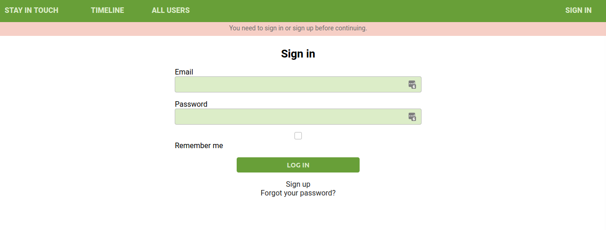
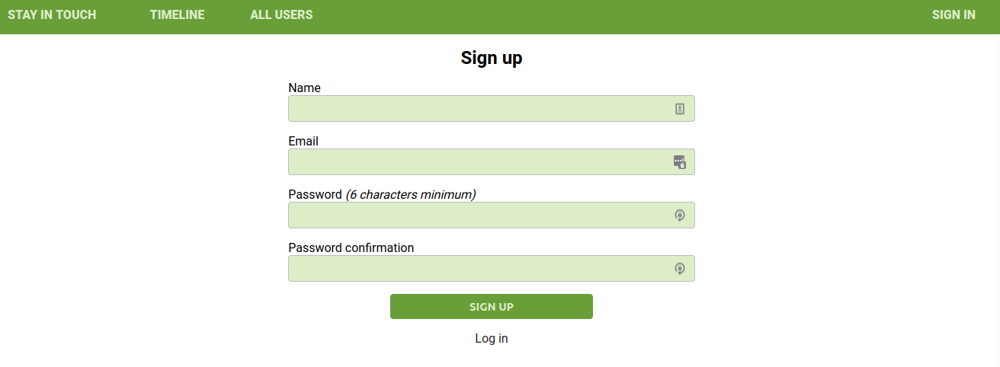
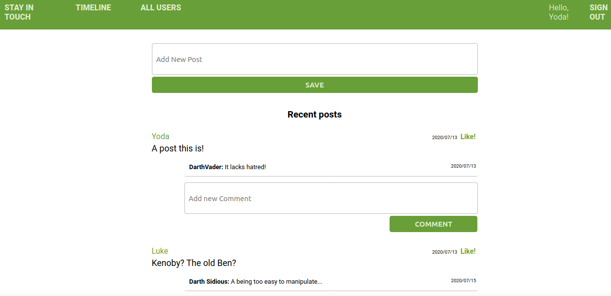
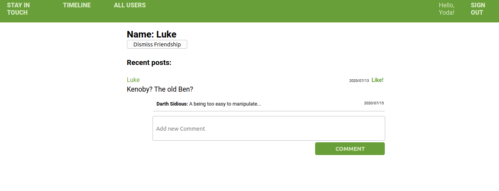

# Social Media App

## Description

This app is a Rails project for the Microverse's RoR curriculum, following TOP curriculum for webdevelopment. We have practiced how to deal with self-join tables and much more.

## About the project

In this app, you can ask people to be friends! (we don't guarantee they'll accept)

## Authorization

For asking someone to be your friend, or even see their posts, you need to log in first. You have to create an account if you don't have one - that'll require name, password and email.

## Screenshots

### Logged out. You can't see any posts, nor add friends.

### Sign Up page.

### Posts Index - you can see all your posts - and all your friends' too!

### User's profile page. You can see all their posts, and if it's not the current user, you can add them too.

## Validations

- New users need to have an username, and it has a max of 20 char.
- A Post must have a text with a max of 1000 char.

## Built With

- [Ruby](https://www.ruby-lang.org/en/) 2.7.0 - A programming language.
- [Ruby on Rails](https://rubyonrails.org/) 6.0.3.1 - A Ruby framework for web development

## Database

- Whenever you ask to befriend someone, you create an instance of Friendship table.
- Whenever you accept the friendship, you create another instance, with ids reversed, and update both instances with "confirmed = true".

## Getting started

### Prerequisites

- Ruby
- Rails
- Bundle
- SQLite3. **Note**: You can change the database in GemFile.

#### For testing

- Capybara
- Rspec-Rails

### Installing

1. Download this repository

`$ git clone repo_url`

2. Install all required gem.

`$ bundle install`

3. Migrate the database.

`$ rails db:migrate`

### Running the tests

You can run tests with

`$ rspec `

## Authors

👤 **Pedro Donda**

- Github: [@Phfdonda](https://github.com/phfdonda)
- Twitter: [@phfdonda](https://twitter.com/phfdonda)
- Linkedin: [Pedro Donda](https://www.linkedin.com/in/pedro-donda-808621bb/)
- Contact: [E-mail](phfdonda@gmail.com)

👤 **Juan Paulo Perez Tejada**

- Github: [@Maclenn77](https://github.com/Maclenn77)
- Twitter: [@srjuanpapas](https://twitter.com/srjuanpapas)
- Linkedin: [Juan Paulo Perez Tejada](https://mx.linkedin.com/in/juanpaulopereztejada)
- Visit [my blog](https://developerz.software/)

## License

This project is licensed under the MIT License - see the [LICENSE.md](LICENSE.md) file for details

## Acknowledgments

* Hat tip to anyone whose code was used

## TODO

- Check specs
