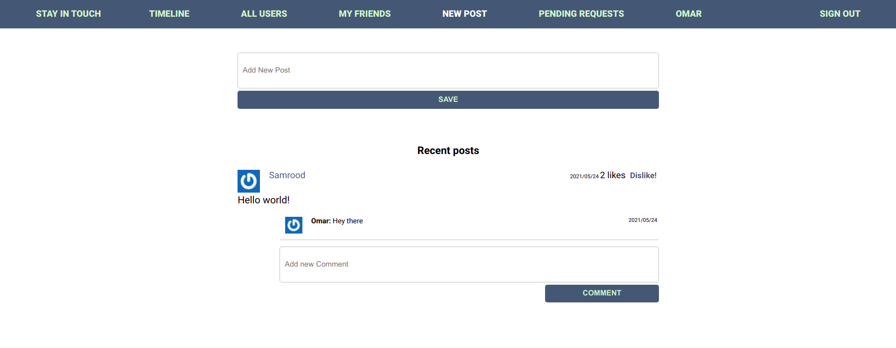
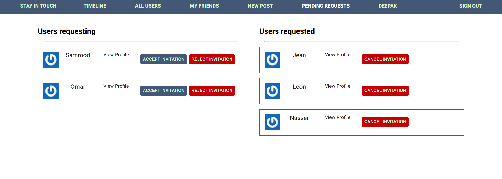

# Stay in touch
A social media app where you can meet new people, request friendships, create and like posts.
Share with the world the people the stories you have. Discuss what's popular with your friends.



## Getting started

To get started with the app, first clone the repo and `cd` into the directory:

```
$ git clone https://github.com/SamroodAli/ror-social-scaffold.git
$ cd members-only
```
on:
  # Triggers the workflow on push or pull request events but only for the development branch
  push:
    branches: [ development ]
  pull_request:
    branches: [ development ]

Then install the needed packages (while skipping any Ruby gems needed only in production):

```
$ bundle install
```

Next, setup webpacker configuration

```
$ rails webpacker:install
```

After that, create and migrate the database:

```
$ rails db:create
$ rails db:migrate
```

To run the project on rails local server:

```
$ rails server
```
## Deploying

To deploy the sample app to production, you’ll need a Heroku account

To deploy this version of the app, you’ll need to create a new Heroku application, switch to the right branch, push up the source, run the migrations, and seed the database with sample users:

```
$ heroku create
$ git checkout updating-users
$ git push heroku updating-users:master
$ heroku run rails db:migrate
$ heroku run rails db:seed
```

Visiting the URL returned by the original `heroku create` should now show you the sample app running in production. 

## Branches

Simply check out the corresponding branch using `git checkout`:

```
$ git checkout <branch name>
```

## Authors


👤 **Samrood Ali**
- GitHub: [@githubhandle](https://github.com/SamroodAli)
- LinkedIn: [LinkedIn](https://www.linkedin.com/in/samrood-ali/)


