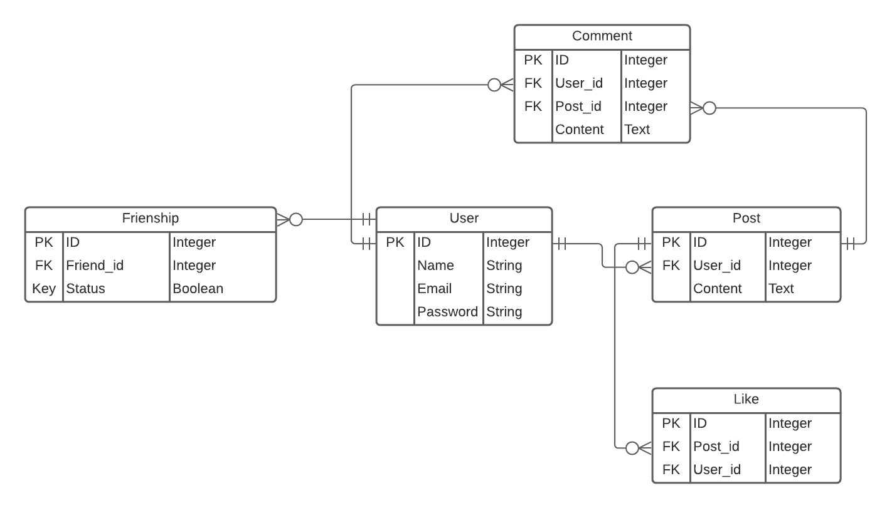

# Stay in touch

> A basic social media page where you can write post, like post, send friend invitations and comment posts

## ERD Diagram



## Built With

- Ruby v2.7.0
- Ruby on Rails v5.2.4

## Getting Started

To get a local copy up and running follow these simple example steps:
- Fork this project
- Open your terminal
- Clone this project `git clone git@github.com:helman101/stay-in-touch.git`
- Go to the project folder `cd stay-in-touch`

### Prerequisites

Ruby: 2.6.3
Rails: 5.2.3
Postgres: >=9.5

### Setup

Instal gems with:

```
bundle install
```

Setup database with:

```
   rails db:create
   rails db:migrate
```

### Github Actions

To make sure the linters' checks using Github Actions work properly, you should follow the next steps:

1. On your recently forked repo, enable the GitHub Actions in the Actions tab.
2. Create the `feature/branch` and push.
3. Start working on your milestone as usual.
4. Open a PR from the `feature/branch` when your work is done.


### Usage

Start server with:

```
    rails server
```

Open `http://localhost:3000/` in your browser.

### Run tests

```
    rpsec
```

## Authors

👤 **Andres Ortegon**

- Github: [@helman101](https://github.com/helman101)
- Twitter: [@Helman1011](https://twitter.com/Helman1011)
- Linkedin: [Linkedin](https://www.linkedin.com/in/helman101/)

## 🤝 Contributing

Contributions, issues and feature requests are welcome!

Feel free to check the [issues page](issues/).

## Show your support

Give a ⭐️ if you like this project!

## Acknowledgments

- TBA
- Microverse

## 📝 License

TBA

