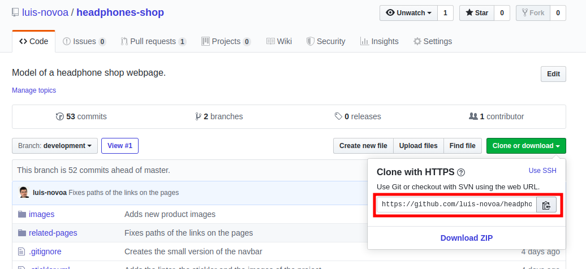
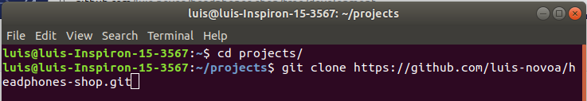
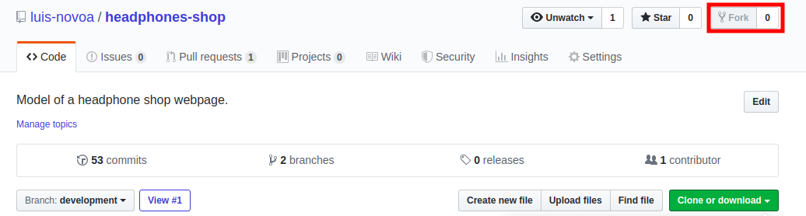
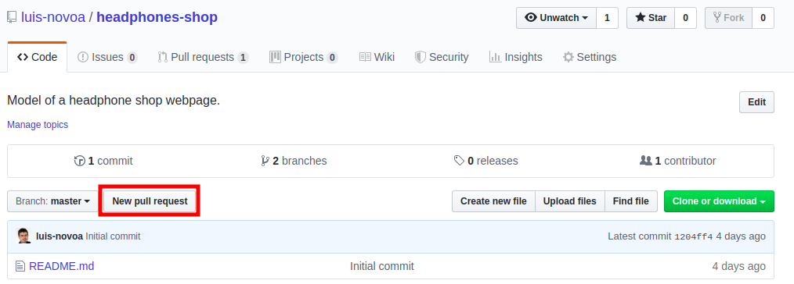
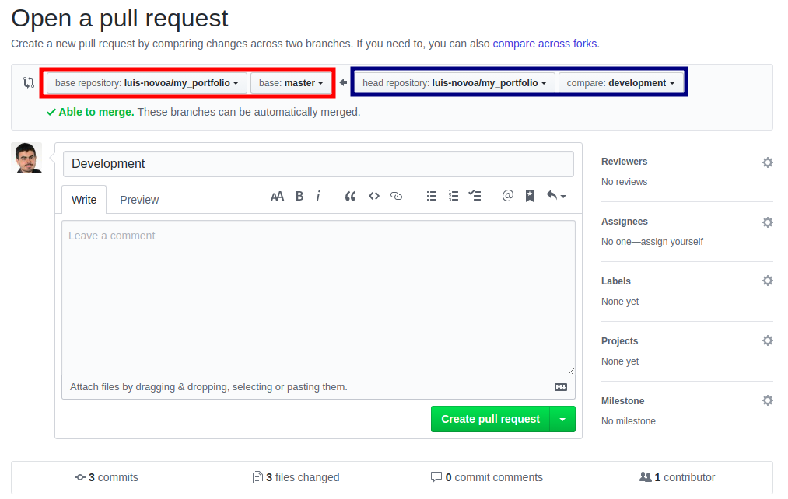

# stay-in-touch

This project focus on building a simple social media app, to practice all the skills acquired through the Microverse's curriculum on Rails, including associations, validations, authorization, active record and the MVC architecture.

## Built With

- Ruby v2.7.0
- Ruby on Rails v5.2.4
- Ruby Mine
- Visual Studio Code

## Live Demo

TBA

## Getting Started

This project is open for anyone who wants to clone it and create their version. If you just want the files and don't want to make further changes, follow the steps below to get a copy in your computer:

1 - Install git in your machine. Follow [this guide](https://www.theodinproject.com/courses/web-development-101/lessons/setting-up-git) by The Odin Project if you haven't done so.

2 - On this repository, click on the "Clone or download" button and copy the URL address provided.


3 - Open your terminal, select the folder where you want to store this project and paste the following code
```
git clone <copiedUrl>
```


Now you have the project files in your computer, but you'll not be able to save any changes on github since you're not the owner or a collaborator of this project. If you want to that, you can fork this project clicking the "Fork" button in the repository's page, which will create a repository named "<yourUserName>/headphones-shop". Follow the aforementioned instructions to download it to your computer.


Now you can edit the project as you please and save your changes on your forked repository on github following the git flow. If you're not familiarized with this concept, follow [this guide about the Git Basics](https://www.theodinproject.com/courses/web-development-101/lessons/git-basics) developed by The Odin Project.

If you have contributions to make, send me a message telling me about your ideas. If we agree on a change, you can code your modifications in your forked repository and create a pull request following these steps:

1 - Click on the "New pull request" button on your forked repository.


2 - You'll be redirected to the page below, where the red square shows the repository and the branch you want the changes implemented, and the blue one shows the repository and the branch from where the changes will come from. Give a title and a description for your pull request, and click on "Create pull request".


3 - I will analyze your proposal and if we agree, I will merge your pull request.

### Prerequisites

- Ruby: 2.6.3
- Rails: 5.2.3
- Postgres: >=9.5

### Setup

Instal gems with:

```
bundle install
```

Setup database with:

```
   rails db:create
   rails db:migrate
```

### Usage

Start server with:

```
    rails server
```

Open `http://localhost:3000/` in your browser.

### Run tests

```
    rpsec --format documentation
```

Tests will be added by Microverse students. There are no tests for initial features in order to make sure that students write all tests from scratch.

### Deployment

TBA

## Authors

👤 **David Auza**

- GitHub: [davidauza-engineer](https://github.com/davidauza-engineer)
- Twitter: [@davidauzaeng](https://twitter.com/davidauzaeng)
- LinkedIn: [David Auza](https://linkedin.com/in/davidauza)

👤 **Luis Novoa**

- GitHub: [luis-novoa](https://github.com/luis-novoa)
- Twitter: [@LuisMatteNovoa](https://twitter.com/LuisMatteNovoa)
- Linkedin: [Luis Novoa](https://www.linkedin.com/in/luismattenovoa/)

## 🤝 Contributing

Contributions and feature requests are welcome!

## Show your support

Give a ⭐️ if you like this project!

## 📝 License

This project is [MIT](./LICENSE) licensed.

