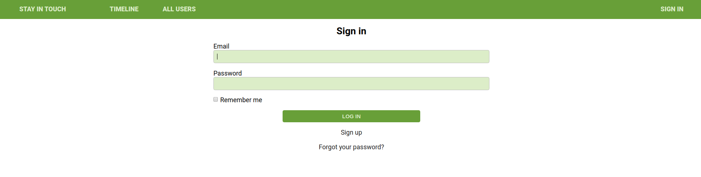

# Members only!

> Implementing friendship functionlity.

    

The porpuse of this project is to implement friendship functionality.

- I want to be able to send a friendship invitation.
- I want to see a button “Invite to friendship” next to the name of user who is not my friend yet - on both users’ list and single user page.
- I want to be able to see pending friendship invitations sent to me from other users.
- I want to be able to accept or reject friendships invitation.
- I want to be able to see “Timeline” page with posts (with number of likes and comments) written by me and all my friends (the most recent posts on the top).

## Built With

- Ruby on Rails 5.2.4

## Authors

👤 **Ivan Ulises Guzman Sanchez**

- Github: [@fivan18](https://github.com/fivan18)
- Twitter: [@fivanunam](https://twitter.com/fivanunam)
- Linkedin: [fivan](https://www.linkedin.com/in/fivan)

👤 **Remy Certil**

- Github: [@certilremy](https://github.com/certilremy)
- Twitter: [@certilremy](https://twitter.com/certilremy)
- Linkedin: [certilremy](https://linkedin.com/in/certilremy)

## 🤝 Contributing

Contributions, issues and feature requests are welcome!

Feel free to check the [issues page]().

## 📝 License

This project is [MIT]() licensed.
