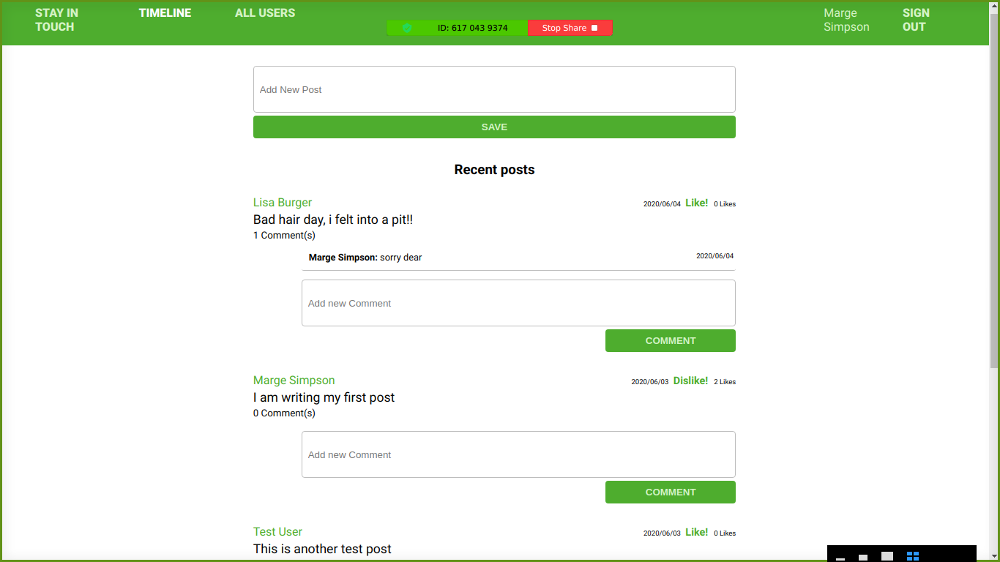

# Scaffold for social media app with Ruby on Rails

> On this project we had to finish a social media app by adding friendship requests to it, as well as build an ERD for the project.



## Built With

- Ruby >= 2.7.2
- Ruby on Rails >= 6.1.3.1

## Live Demo

TBA

## Entity Relationship Diagram


## Getting Started

To get a local copy up and running follow these simple example steps.

### Prerequisites

- Ruby >= 2.7.2
- Ruby on Rails >= 6.1.3.1
- Postgres >= 9.5

### Setup

Install gems with:

```
bundle install
```

Setup database with:

```
   rails db:create
   rails db:migrate
```

### Github Actions

To make sure the linters' checks using Github Actions work properly, you should follow the next steps:

1. On your recently forked repo, enable the GitHub Actions in the Actions tab.
2. Create the `feature/branch` and push.
3. Start working on your milestone as usual.
4. Open a PR from the `feature/branch` when your work is done.


### Usage

Start server with:

```
    rails server
```

Open `http://localhost:3000/` in your browser.

### Run tests

```
    rpsec --format documentation
```

### Troubleshooting

#### Error "Webpacker::Manifest::MissingEntryError" on starting application

- stop the web app
- run `bundle exec rake webpacker:install`
- run `rails s`

### Deployment

TBA

## Author

👤 **Fernando R P Marques**

- GitHub: [@fernandorpm](https://github.com/fernandorpm)
- Twitter: [@rpm_fernando](https://twitter.com/rpm_fernando)
- LinkedIn: [Fernando R P Marques](https://linkedin.com/fernandorpm)

## 🤝 Contributing

Contributions, issues and feature requests are welcome!

Feel free to check the [issues page](../../issues/).

## Show your support

Give a ⭐️ if you like this project!
