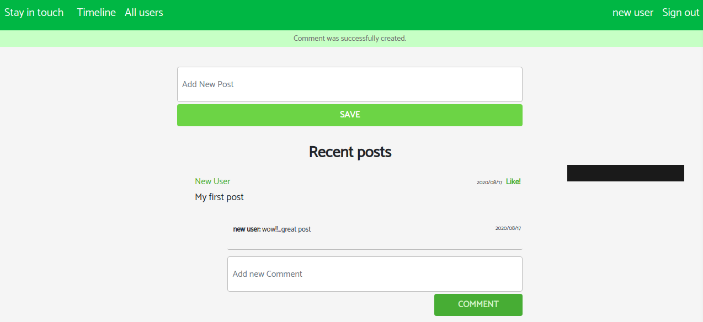

# ror-social-scaffold

This project is about building a social media platform when logged In users can write a post, follow and unfollow other singed Up users. Guest users will only be able to see post.

## Built With

- Ruby 2.7.1
- Rails 6.0.3.2
- VS Code


## Prerequisites
In order to make the program work, you need to have ruby interpreter installed in your system. You can get the latest version of ruby from [official website](https://www.ruby-lang.org/en/downloads/).





## Getting Started 

1. clone the project

```bash
# Clone this repository
$ git clone https://github.com/tGodson/ror-social-scaffold.git

# Go into the repository
$ cd ror-social-scaffold

# make sure you have ruby 2.7.1
# install gems from Gemfile using bundle
$ bundle install

# migrate table to database

$ rails db:migrate

## Usage

_you can create a user by clicking on the signup button at the top right of your screen and fill the sign up form

_You can sign In by clicking on the sign In button at the top right of your screen and filling the form

_You can create a post when you are logged In by clicking on the `create post` Button and fill the form

_You can follow a friend by clicking the `invite` button next to the name of the friend on the `all users` page

## Authors

👤 **Ignatius Sani**

- Github: [ignatius22](https://github.com/ignatius22)
- Twitter: [@Iggy_code](https://twitter.com/iggy_code)
- Linkedin: [linkedin](https://www.linkedin.com/in/ignatiussani)

👤 **Tendongze Godson**
- Github: [tGodson](https://github.com/tGodson)
- Twitter: [@tendongze95](https://twitter.com/tendongze95)
- Linkedin: [linkedin](https://www.linkedin.com/in/tendongzegodson)

## 🤝 Contributing

Contributions, issues and feature requests are welcome!

Feel free to check the <a href="https://github.com/ignatius22/ror-social-scaffold/issues" target="_blank">issues page</a>.

## Show your support

Give a ⭐️ if you like this project!

## Acknowledgments
 
- <a href="https://www.theodinproject.com/" target="_blank">The Odin Project</a>